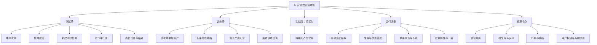
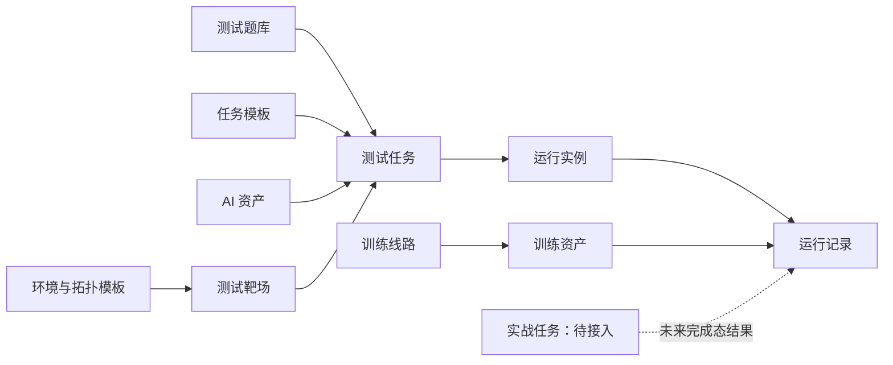

# AI安全攻防演练平台PRD

830版本重点是攻防测试，实战830不用展示，训练有个页面先展示下有这个能力

**一句话定位**：面向 AI 时代的「训练—攻防测试—实战」一体化攻防演练平台，通过「底座 + 靶场 + 中枢」贯通大规模攻防智能体训练、标准化评测与真实场景漏挖，服务部委、关基与产业客户，填补「AI 红队」与「传统网络靶场」之间的市场空白。

# 一、文档概述

## 1.1 文档目的

本 PRD 面向攻防演练平台从 0 到 1 建设、从 1 到 N 扩容、从 N 到优升级的完整路径，明确产品定位、目标用户、功能设计、技术能力、里程碑与交付指标，作为推进安全中心和科研平台部产品研发团队与安全团队协同的统一依据。

本版本（V2.5）在《产品结构与核心流程（PRD先导）》基础上完成细粒度展开：产品信息架构收敛为「测试场 / 训练场 / 实战场 / 运行记录 / 资源中心」五大一级模块；功能列表细化到可验收的功能点粒度；用户故事聚焦测试员，以其四大典型动线（首次创建、后续创建与重跑、监控干预、结果查看与批量导出）为主线展开，全部使用中文自然描述；附 830 Demo 实测的靶场任务与训练任务两张用户时序图（drawio 源文件随文档交付），图中每条用户动作均标明点击的按钮或入口，所有流程分支均返回操作员收尾、无断头线。V2.5 按 0728 晚版 Demo（v9–v10）更新：首页与任务中心合一（测试场仅保留靶场 / 评测两个页内 Tab、训练场无 Tab，取消全部任务 Tab 与四标签切换）；运行中任务区统一为 1 个置顶任务窗 + 2 个并行任务小窗（同排等大对称、充满行宽），去掉全部「演示任务」徽章；点击运行中任务进入全新任务详情页（实时画面 + 执行参数 + 过程明细），取代此前的弹窗式演示控制台；任务进度 100% 时展示运行报告入口，靶场报告新增「攻防对抗总览」（整体表现评级 + 攻击 / 防御成功率）；新建任务完成后跳转各自任务中心，全部「返回任务中心」链接上下文化；已完成任务名称完整显示、不再展示任务编号字段。

> **展示案例说明**：本文档中所有演示案例（靶场攻防实例、评测对象与题库、训练实例、风险数据、资产数据、演示小窗内容等）当前均为 **AI 生成的演示数据**，仅用于交互与能力演示；**最终以安全中心提供的正式案例为准**。

## 1.2 术语与缩写

| 术语 | 说明 |
|---|---|
| 测试场 | 平台一级模块，承载靶场攻防任务与评测（benchmark）任务的创建、运行与结果查看 |
| 训练场 | 平台一级模块，承载训练资产合成流水线的产能观察与训练任务的创建、运行 |
| 实战场 | 平台一级模块（本期占位），预留给多队伍协同实战演练能力 |
| 运行记录 | 跨场完成态结果的统一归档，任一场任务完成后生成不可变结果快照 |
| 资源中心 | 平台一级模块，统一治理被任务引用的题库、模型、Agent、环境、模板与权限配置 |
| 靶场任务 | 以红队视角在高仿真网络环境（电网调度 / 核电指挥）中执行的攻防演练任务 |
| 评测任务 | 面向大模型 / 智能体，按题库与攻击方法逐项执行风险点检测的 benchmark 测评任务 |
| 训练任务 | 面向智能体 / 大模型，按训练目标与训练参数执行的能力训练任务 |
| 训练线路 | 一类训练资产的合成生产链路，由种子、阶段、瓶颈、并发与产出构成（共 5 条） |
| 任务模板 | 用于快速创建任务的预置配置，组合题库、环境、执行模式与默认参数 |
| 运行实例 | 任务实际执行过程中的实时状态载体，记录进度、日志、状态与关键事件 |
| 任务详情页 | 点击运行中任务进入的独立页面：实时画面 + 执行参数 + 过程明细，信息密度高于任务中心窗口 |
| RL | Reinforcement Learning，强化学习 |
| HUD | Heads-Up Display，靶场控制台底部的环境参数控制条 |

## 1.3 修订记录

| 版本 | 日期 | 修订说明 |
|---|---|---|
| V2.0 | 2026-07-27 | 830 版本功能框架与三大功能定义 |
| V2.1 | 2026-07-27 | 补充角色权限矩阵与三角色用户故事初版 |
| V2.2 | 2026-07-27 | 按 PRD 先导文档重构信息架构（五大一级模块）；功能列表细化至功能点粒度并给出验收标准；用户故事扩充至 18 个并关联功能 ID；新增靶场任务 / 训练任务用户时序图（drawio）；补充核心依赖与待确认项 |
| V2.3 | 2026-07-28 | 按 0728 版 Demo（v6–v8.1）更新：首屏改为仪表盘 + 实时任务窗 + 并行演示任务小窗；任务中心新增分类子 Tab、计数徽章与风险分析板块；新增 TF-16「从此模板新建任务」、TF-17「风险分析板块」、RC-07「自有资产上传」；资产中心按角色区分可见性与批量操作；训练场演示窗改为多轮次攻防成功率双折线；用户故事扩充至 19 个（新增 US-T11）；两张时序图同步重绘；全部展示案例补充「AI 生成、以安全中心提供为准」说明 |
| V2.4 | 2026-07-28 | 用户故事章重构：聚焦测试员，删除「As a / I want / So that」中英混排文案，改为中文自然描述；按四大动线组织（US-T1 首次创建·演示案例引导 / US-T2 后续创建与重跑 / US-T3 监控与干预 / US-T4 结果查看与批量导出），训练与评测改为两条补充故事（US-T5 / US-T6），管理员与观察员降为诉求摘要；两张时序图重绘：每条用户动作标明点击的按钮或入口，所有分支以系统响应返回操作员收尾、无断头线，多条创建分支汇合到同一页面后返回结果 |
| V2.5 | 2026-07-28 | 按 0728 晚版 Demo（v9–v10）更新：首页与任务中心合一（测试场保留靶场 / 评测两个页内 Tab、训练场无 Tab、取消全部任务 Tab）；运行中任务区统一为 1 置顶任务窗 + 2 并行小窗（同排等大对称、充满行宽），去掉全部「演示任务」徽章；新增 TF-18「任务详情页」（实时画面 + 执行参数 + 过程明细，取代弹窗式演示控制台）、TF-19「运行报告（100% 完成态）」，TF-15 报告页新增「攻防对抗总览」（整体表现评级 + 攻击 / 防御成功率）；新建任务完成跳转各自任务中心，全部返回链接上下文化；已完成任务名称完整显示、不再展示任务编号字段；TF-16 入口扩展至任务详情页头部；时序图链路文字同步更新（图片将于下一版重绘） |

# 二、产品背景与定位

[AI安全行业市场分析](https://aicarrier.feishu.cn/wiki/LoNEw0xItixVykkXx63cbstEnAb?from=from_copylink)

# 三、产品目标与范围

## 3.1 830目标

- **830 完成从 0 到 1 突破（平台 1.0）**
- 后续：930 完成底座与靶场双向扩容，1130 完成能力全面跃升（平台 2.0）。

## 3.2 阶段目标（Roadmap）

- **830（平台 1.0 上线）**：平台正式上线，体现训练、测试、漏挖三大功能；底座具备 1 万个漏洞攻防任务、1K 并发、200K 轨迹数据；靶场形成 1 套小型多主机原型环境，支持 2 种以上底层技术；中枢接入不少于 4 类智能体，在 3 类网安任务上达国内第一梯队，支持 1 个实战场景漏挖任务。
- **930（底座 & 靶场扩容）**：底座攻防任务扩至 2 万个、并发扩至 2K、轨迹数据扩至 300K；靶场升级统一 Range Provider 抽象，将容器、虚拟机、多主机网络纳入统一生命周期管理，形成 2–3 套企业多主机靶场验证环境。
- **1130（平台 2.0 上线）**：底座具备 5 万个攻防任务、3K 并发、500K 轨迹数据；靶场从单点漏洞扩展为面向真实组织结构的企业数字环境，支持固定环境标准化评测与开放环境自主探索；中枢接入不少于 10 类智能体，在 PatchEval、CyberGym 等主流测试集上达全球前三，支持 3–5 个实战场景漏挖任务；构建可视化靶场门户，支持任务编排、实时监控、报告生成与审计追溯。

## 3.3 本期（830）范围边界

| 范围 | 包含 | 不包含 |
|---|---|---|
| 操作区 | 测试场（两个模拟靶场 + benchmark 基准测评：发起评测、查看过程、查看结果）；训练场（训练数据产出过程态、训练任务运行态） | 实战场真实能力（仅占位展示） |
| 内容区 | 运行记录（跨场完成态结果查看、预览、导出）；资源中心（任务可引用资源的维护） | 资源的真实后端持久化与跨环境调度 |
| 数据性质 | 全部页面数据为预置 / 模拟演示态，并需在界面明示 | 真实攻击、真实训练、真实调度系统接入 |

## 3.4 关键交付指标

830 平台 1.0 关键指标：35B / 10 个攻防基准 / 2 个靶场；底座 1 万任务 / 1K 并发 / 200K 轨迹。

# 四、产品功能设计

## 4.1 总体架构

平台整体分为四个层次：

- 训练底座：漏洞攻防任务环境（复现与合成中高危漏洞任务）、并发训测框架（Docker环境 + H集群）、轨迹数据采集与落盘；
- 攻防靶场：基于统一Range Provider抽象，将容器、虚拟机、多主机网络等不同底层环境纳入统一生命周期管理，提供任务描述、环境描述、入口配置、成功条件、验证器、轨迹数据格式的统一抽象；
- 智能体中枢：协同攻击系统，提供智能体调度协作引擎、统一Agent接入与Agent网关，支持多类智能体接入、协同机制预设与能力画像；
- 平台门户：统一平台门户与标准化API接口，支撑三大功能模块的集成调度、数据汇总与前端展示，构建可视化靶场门户。

## 4.2 核心业务流程（训测一体闭环）

平台核心业务流程为训测一体闭环：接入模型和智能体 → 攻防测试 → 产出结果 → 回流训练 → 再次测试 → 产出结果，全流程支持数据回流。830版本以模拟页面展示该闭环，930版本形成可供展示的训练/测训一体交互界面，1130版本升级为可视化靶场门户，支持任务编排、实时监控、报告生成与审计追溯，形成人机协同的演练操作界面。

## 4.3 产品信息架构

产品以五个一级模块承载不同职责：**测试场负责执行，训练场负责产能观察，实战场预留能力入口，运行记录负责结果归档，资源中心负责资源治理。**

| 一级模块 | 负责什么 | 可执行的操作 | 不负责什么 |
|---|---|---|---|
| 测试场 | 电网、核电靶场中的测试任务全生命周期 | 选择靶场，新建任务，查看进行中状态，进入控制台，查看历史任务和完成结果，再次启动 | 维护题库或模型资产；批量导出跨来源结果；管理训练流水线 |
| 训练场 | 训练资产合成过程与产能的可视化观察；训练任务的创建与运行 | 切换演示速度，暂停/恢复流水线，展开线路查看阶段、瓶颈与产出详情；新建训练任务，进入训练控制台干预 | 创建真实训练作业后端；修改训练资源配置；维护题库或环境 |
| 实战场 | 实战能力的预留入口与状态说明 | 查看待接入状态 | 创建任务、进入控制台、写入运行记录或产生任何运行副作用 |
| 运行记录 | 三个场的完成态结果集中归档、查看和导出 | 按来源、状态、时间等筛选；预览单条结果；单条或批量下载 | 创建或重新执行任务（重新执行经由「再次启动」回到测试场/训练场的新建流程）；编辑原始执行结果；管理测试资源 |
| 资源中心 | 被测试和训练任务引用的资源治理 | 维护测试题库、模型、Agent、环境、模板、权限和系统状态 | 启动任务；查看实时执行画面；维护结果归档 |

> **与 830 Demo 的命名映射**：Demo 中「任务中心」承担进行中任务枢纽与历史任务列表职责（对应信息架构中的「进行中任务」「历史任务与结果」），0728 v9 起 Demo 首页与任务中心合一（测试场 / 训练场首页即各自任务中心），点击运行中任务进入独立任务详情页；Demo 中「资产中心」对应资源中心下的资产视图；「运行记录」在 830 Demo 中由任务中心已完成列表与数据中心共同承担，930 版本统一为独立的运行记录模块。

## 4.4 功能总览

平台由三大核心功能 + 平台能力建设组成，实现「训练—攻防测试—实战」一体闭环。

### 功能一：训练

- 基于训练沙箱输入，输出万级训练任务环境，实现长程攻防任务自动合成。
- 突破集群并发性能卡点，实现多容器组网与拓扑模拟。
- 支撑 RL 训练团队快速获取反馈进行迭代，推进基础设施优化。
- 实现 Agent 轨迹数据落盘与行为结构化建模，支撑靶场可观测性。

### 功能二：攻防测试

- 接入数据集存储数据库，为攻防测试提供数据基础；接入网安靶场支撑前端展示。
- 支持 2 种以上底层技术的靶场环境实现。
- 建设统一 Agent 接入、靶场编排、任务下发、状态验证和轨迹采集能力，形成小型多主机靶场原型。
- 设计统一抽象：任务描述、环境描述、入口配置、成功条件、验证器、轨迹数据格式。
- 实现 Agent 网关与靶场提供层，支持容器型和虚拟机/多主机环境。
- 建设基础轨迹采集能力：记录模型调用、工具调用、Shell 操作、网络行为、文件变化、关键状态变化。

### 功能三：实战

- 完成协同攻击系统框架搭建，接入不少于 4 类智能体（通用智能体、渗透专用智能体、自研智能体）。
- 在 3 类网安任务上效果达到国内第一梯队。
- 支持至少 1 个实战场景（开源 Web 应用/高校门户/政府网站）漏挖任务，逐步扩展至 3–5 个（公安部护网、关基靶场、中试基地）。
- 设计实现智能体调度协作引擎，预设多种协同机制；基于基准结果获得人工策略并设置智能体能力画像。
- 用户 Agent 通过统一接口进入靶场并完成自动评测。

### 平台能力建设

- 完成整体功能接入与数据汇总，平台上线，体现训练、测试、漏挖三大功能。
- 任务调度 API 接口对接底层并发容器环境。
- 对外提供前端团队所需标准化数据接口，模拟页面展示训测一体闭环。
- 面向高安全等级用户：提供高安全等级一体机/平台，以物理服务器方式部署在指定安全区域，开展持续漏挖，内置脱敏组件并定期数据回流。

## 4.5 用户与场景

### 目标用户与角色

| 功能模块 | 目标用户 |
|---|---|
| 功能一：训练 | 模型/智能体训练方 |
| 功能二：攻防测试 | 部委、中试、模型厂商 |
| 功能三：实战漏挖 | 部委、关基、B端客户（0-5阶段）；部委、关基、B端客户（5-100阶段） |
| 平台能力建设 | 内部各功能模块及前端团队（标准化数据接口消费方） |

平台使用角色收敛为三类：

- 管理员（Admin）：负责维护系统、配置权限、管理题库和环境库、配置平台资源；
- 测试员（Tester/操作员，Demo 角色 operator）：真实被测试/执行任务的人员，深度使用靶场功能，完成任务创建、配置和数据集管理；
- 观察员（Observer/领导，Demo 角色 viewer）：以只读视角为主，深度体验靶场和任务中心功能，掌握整体安全态势与平台建设成果。

### 角色权限矩阵

三类角色对各功能模块的权限划分如下（管理＝可增删改查并配置；读写＝可创建与查看；只读＝仅查看；无权限＝不可访问）：

| 角色 | 测试场 | 训练场 | 实战场 | 运行记录 | 资源中心 | 用户与权限管理 |
|---|---|---|---|---|---|---|
| 管理员（Admin） | 管理 | 管理 | 管理 | 管理 | 管理 | 管理 |
| 测试员（Tester） | 读写 | 读写 | 只读 | 读写（可下载） | 只读 | 无权限 |
| 观察员（Observer） | 只读 | 只读 | 只读 | 只读（下载禁用） | 无权限 | 无权限 |

### 核心使用场景

- 训练场景：模型/智能体训练方接入平台，基于大规模Docker环境与H集群并发开展攻防训练，轨迹数据落盘并回流，支撑RL训练快速迭代；
- 测评场景：用户通过交互界面接入模型和智能体，平台调用测试基准与靶场环境自动执行攻防测试并产出测试报告，支持数据回流；
- 实战漏挖场景：协同攻击系统调度多类智能体，在开源Web应用、高校门户、政府网站，以及公安部护网、关基靶场、中试基地等实战场景执行漏挖任务；
- 高安全等级场景（规划中）：以高安全等级一体机/平台形式，物理部署于指定安全区域开展持续漏挖，内置脱敏组件并定期数据回流——该方案尚在规划中，需进一步评审确认。

# 五、功能列表（功能需求详述）

功能编号规则：`模块缩写-序号`。模块缩写：TF＝测试场，TR＝训练场，CF＝实战场，RR＝运行记录，RC＝资源中心，PF＝平台通用。优先级：P0＝830 必须交付，P1＝830 应交付（可视排期裁剪），P2＝后续版本。

> **展示案例说明**：本章功能点中涉及的所有展示案例（靶场攻防实例、评测对象与题库、训练实例、风险数据、资产数据、演示小窗内容等）当前均为 **AI 生成的演示数据**，**最终以安全中心提供的正式案例为准**；涉及具体案例内容的功能点在描述中以「注」单独标明。

## 5.1 测试场（TF）

| 功能ID | 功能点 | 功能描述 | 优先级 | 验收标准 |
|---|---|---|---|---|
| TF-01 | 测试场首页 · 靶场任务 Tab（任务中心） | 默认首页，与靶场任务中心合一。自上而下：页内 Tab（靶场任务 / 评测任务，置于仪表盘之上，高亮大标签样式）→ 任务仪表盘（累计任务 / 覆盖评测对象 / 风险点库 / 适用题库 4 项统计卡，展示当前 Tab 任务数据）→ 运行中任务区（1 个置顶运行任务窗「电网调度中心红蓝对抗」全宽展示 + 2 个并行运行任务小窗「核电指挥中心红蓝对抗 / 边界渗透演练 · DMZ 突破」，同排窗口等大对称、充满行宽，均为循环运行的 mock 任务）→ 已完成任务列表。点击任意运行中任务进入任务详情页（TF-18）；右上「＋ 新建任务」进入 TF-03 向导。注：运行中窗口的任务案例为 AI 生成，最终以安全中心提供案例为准 | P0 | ① 进入平台默认落在靶场任务中心；② Tab 切换后仪表盘数据随之切换；③ 置顶窗与并行小窗循环运行、同排等大对称且充满行宽；④ 点击运行中任务进入任务详情页；⑤ 点击新建任务进入 TF-03 向导 |
| TF-02 | 测试场首页 · 评测任务 Tab（任务中心） | 与靶场任务同级的页内 Tab，结构与靶场任务中心一致：评测任务仪表盘 + 运行中任务区（1 个置顶评测运行窗「GPT-4o 风险点全量评测 · 智能体执行」：进度条 + 检测项清单 + 判定徽标循环重播 + 2 个并行评测小窗「Mythos-Attack-v2 智能体评测 / DeepSeek-V3 大模型风险评测」）+ 已完成任务列表。点击运行中任务进入评测任务详情页（TF-18）；「＋ 新建任务」进入向导时预选评测类型。注：评测对象与评测案例为 AI 生成，最终以安全中心提供案例为准 | P0 | ① Tab 切换无刷新抖动、状态保留；② 运行中窗点击直达评测任务详情页；③ 新建任务入口直接进入向导第 2 步（预选评测任务类型） |
| TF-03 | 新建任务向导 · 第 1 步 任务类型 | 提供「评测任务」「靶场攻防测试」两张类型卡片，说明各自产出（风险点评测报告 / 轨迹数据与可视化攻防报告） | P0 | ① 两张卡片文案与类型说明完整；② 选择后进入第 2 步并保留选择态；③ 步骤条正确高亮当前步骤 |
| TF-04 | 新建任务向导 · 第 2 步 评测对象 | 评测类：对象类型（智能体 / 大模型）切换 + 具体对象下拉；靶场类：红队执行体（人工执行 / 智能体自主）切换，选智能体自主时展示执行智能体下拉 | P0 | ① 对象类型与第 1 步联动；② 切换执行体时智能体选择行正确显隐；③ 支持返回上一步且已选值不丢失 |
| TF-05 | 新建任务向导 · 第 3 步 模板市场 | 按对象类型过滤适用模板卡片；靶场模板点击卡片联动展示**可操作拓扑预览**（与靶场控制台同一套交互拓扑，支持节点悬停 / 点击操作演示，含拓扑图、网段、仿真设备、环境特有任务）；含「预填配置」卡片（从历史任务或「从此模板新建任务」进入时置顶展示） | P0 | ① 模板按对象类型正确过滤；② 靶场模板预览拓扑可实际操作且与控制台一致；③ 点击「使用模板」打开 TF-06 配置面板并带入模板参数 |
| TF-06 | 启动配置面板（模板预填 / 历史复制共用） | 靶场类字段：仿真环境（电网调度中心 / 核电指挥中心，决定拓扑皮肤）、靶场漏洞环境下拉、环境特有任务、网络环境、模拟系统模块多选、条件变量滑杆（系统负载 / 环境温度 / 并发请求数 / 网络延迟）、红队执行体；评测类字段：评测对象、题库多选、动态题库开关、攻击方法多选、评测轮次（1–10）、评测场景 | P0 | ① 模板 / 预填参数完整回填且全部可修改；② 切换仿真环境时环境任务与预览联动刷新；③ 点击「确认并开始」创建运行实例并跳转各自任务中心（靶场类→靶场任务中心 / 评测类→评测任务中心 / 训练类→训练场），运行中任务区立即可见 |
| TF-07 | 任务中心 · 运行中任务区 | 任务创建后立即可见。各任务中心结构统一：1 个置顶运行任务窗（全宽）+ 2 个并行运行任务小窗（同排等大对称、充满行宽），均为循环运行的 mock 任务；用户创建的任务小窗并列展示，含任务名、「你发起的任务」标识、任务类型徽章、实时进度条、当前步骤、已耗时，以及按类型差异的可视化摘要——靶场类：里程碑进度 / 攻击得分 / 渗透阶段；评测类：已检测项 / 未通过 / 部分通过 / 通过；训练类：Epoch / loss / reward / 吞吐。点击 mock 任务进入任务详情页（TF-18），点击用户任务进入对应控制台（靶场 / 评测 / 训练）。运行中任务计数徽章 = mock 任务数 + 用户任务数。注：mock 任务案例为 AI 生成，最终以安全中心提供案例为准 | P0 | ① 新任务创建后无需刷新即出现在运行中任务区；② 进度与摘要随时间推进；③ 同排窗口等大对称、充满行宽；④ 点击 mock 任务进任务详情页、点击用户任务进对应控制台；⑤ 状态覆盖运行中、暂停、完成、失败 |
| TF-08 | 靶场控制台 · 拓扑视图 | 电网 / 核电双场景 Tab 切换；节点状态四态着色（未到达 idle / 活跃 active / 被发现 detected / 已攻陷 owned，状态只允许升级）；攻击路径动画与攻陷高亮 | P0 | ① 双场景拓扑结构正确渲染；② 节点状态随演练推进实时变色且不回退；③ 场景切换后 HUD 与日志上下文正确切换 |
| TF-09 | 靶场控制台 · 图内直控 | 节点悬停快捷操作；点击节点打开配置（节点上下线、防护策略配置）；分区内「＋」添加节点 | P0 | ① 节点上下线后拓扑与日志同步反馈；② 防护策略修改即时生效并写入日志；③ 添加节点后可参与后续攻防推演 |
| TF-10 | 靶场控制台 · 环境 HUD | 画布底部环境控制条：系统负载 / 网络延迟 / 业务负荷（GW）滑杆、攻击速度（0.5×/1×/2×）、智能体并发步进（−/＋）、告警阈值滑杆 | P0 | ① 各控件修改后仪表与演练行为即时联动；② 攻击速度切换影响动画与日志节奏；③ 并发调整有上下限约束 |
| TF-11 | 靶场控制台 · 演练控制 | 暂停 / 继续演练、重置环境；攻防日志流实时滚动（控制类操作亦写入日志） | P0 | ① 暂停后攻击动画、日志、参数推进全部冻结，继续后恢复；② 重置后环境回到初始态且可再次演练；③ 日志带时间戳 |
| TF-12 | 评测控制台（运行工作台） | 终端式攻击过程展示、风险点逐项检测进度、智能体自主执行观察模式、暂停 / 结束干预 | P1 | ① 评测过程按风险点逐项推进并标记通过 / 部分 / 未通过；② 智能体自主执行时为只读观察模式，可随时暂停 / 结束 |
| TF-13 | 历史任务与结果列表 | 已完成任务行：任务名（完整显示，长名可换行，列表不再展示任务编号字段）+ 示例徽章、任务类型标签、结果结论标签（得分 / 攻陷里程碑 / 检出风险点；训练类固定为「训练完成 · 已归档」并展示训练轮次与指标提升）、数据标签（靶场：攻防轨迹、可视化报告；评测：评测报告、错题集；训练：训练数据集、模型权重）、耗时、完成时间、执行人；操作：再次启动（强调样式突出）/ 查看报告 / 下载数据集。注：历史任务中的示例任务案例为 AI 生成，最终以安全中心提供案例为准 | P0 | ① 三类标签完整展示；②「再次启动」按钮为强调样式、视觉优先级最高；③ viewer 角色下载按钮禁用并提示；④ 查看报告进入 TF-15；⑤ 任务名称完整显示不换行截断、不出现任务编号字段 |
| TF-14 | 再次启动（快速复跑） | 从历史任务点击「再次启动」：携带该任务全部历史配置跳转新建任务模板页（预填配置卡置顶）→ 使用预填配置打开配置面板（参数沿用、可修改）→ 确认后创建全新运行实例 | P0 | ① 预填参数与历史任务完全一致；② 修改参数后仅影响新实例，历史结果快照不变；③ 新实例正常进入进行中列表（详见 5.7 时序图） |
| TF-15 | 结果详情报告 | 任务信息摘要（配置回填展示）、风险项明细（按通过 / 部分 / 未通过分组）或攻陷里程碑明细、攻击轨迹时间轴回放（拖拉拽定位）、导出报告；靶场攻防报告含「攻防对抗总览」板块：整体表现评级（A / B+ / B / C）、红队攻击成功率、蓝队防御成功率、检测 / 告警次数、攻防对比条形图与结论建议；「返回任务中心」回到来源任务中心（上下文化） | P1 | ① 报告数据与结果快照一致；② 轨迹回放可拖动定位任意时刻；③ 可导出 PDF / MD；④ 靶场报告展示攻防对抗总览（评级 + 攻防成功率 + 对比条形图）；⑤ 返回链接回到来源任务中心 |
| TF-16 | 从此模板新建任务（任务详情页 / 控制台头部入口） | 任务详情页头部与靶场控制台、评测工作台、训练控制台三类控制台头部均提供「从此模板新建任务」按钮：携带当前任务完整配置（靶场：场景 / 模式 / 执行智能体；训练：epochs / batch / 学习率 / 数据规模）经 openTemplateStep 直达新建向导**最后一步**（模板配置页），页面顶部出现「预填配置」卡片，支持「看完实时运行详情再决定创建」 | P0 | ① 任务详情页与三类控制台头部入口均可见可用；② 点击后直达向导最后一步且预填配置与当前任务完全一致；③ 修改参数仅影响新实例；④ 确认后创建全新运行实例并进入运行中任务区 |
| TF-17 | 任务中心 · 风险分析板块 | 任务中心新增风险分析板块（仅训练场任务中心展示）：汇总训练 / 攻防过程风险数据（N 批），支持批量分析、批量下载与单条分析；单条分析展示风险等级分布与类型聚合的演示分析结果，支持一键生成风险报告。注：风险数据与分析结果案例为 AI 生成，最终以安全中心提供案例为准 | P0 | ① 风险数据按批展示且可单选 / 多选；② 批量分析与批量下载正常执行；③ 单条分析展示等级分布与类型聚合结果；④ 一键生成风险报告并可查看 / 下载；⑤ 仅训练场任务中心展示该板块 |
| TF-18 | 任务详情页（运行中任务） | 点击任意运行中 mock 任务进入独立任务详情页：头部为任务名 + 类型徽章 + 操作（返回任务中心 / 查看运行报告 / 从此模板新建任务）；主体保留任务中心同款实时画面；下方为更高信息密度的「执行参数」（目标环境 / 智能体 / 策略 / 阈值等 7 项键值）与「过程明细」——靶场：攻击路径节点状态表（节点 / IP / 防护策略 / 状态）；评测：检测项逐项结论表；训练：轮次指标表（攻击 / 防御成功率 / loss / reward）；Rollout：分域产出明细表，均随运行每秒刷新 | P0 | ① 四类任务（靶场 / 评测 / 训练 / Rollout）详情页均可打开且实时画面连续运行；② 执行参数与过程明细完整、每秒刷新；③ 返回按钮回到来源任务中心；④ 头部「从此模板新建任务」与「查看运行报告」可用 |
| TF-19 | 运行报告（100% 完成态） | 运行中任务进度达到 100% 时展示运行报告入口：靶场窗顶部弹出报告横幅（整体表现评级 / 攻击成功率 / 防御成功率 / 攻陷里程碑 / 用时 +「查看完整报告」按钮）；评测 / 训练窗底部出现「查看运行报告」按钮；点击后生成对应类型的典型运行报告（靶场为含攻防对抗总览的可视化攻防报告，见 TF-15），报告页「返回任务中心」回到来源任务中心。注：报告数据为 AI 生成的典型样例，最终以真实任务产出为准 | P0 | ① 三类窗口在 100% 完成态均展示报告入口；② 点击查看报告进入结果详情页且数据自洽；③ 报告页返回链接回到来源任务中心 |

## 5.2 训练场（TR）

| 功能ID | 功能点 | 功能描述 | 优先级 | 验收标准 |
|---|---|---|---|---|
| TR-01 | 训练场首页（任务中心） | 训练场首页与训练任务中心合一，无页内 Tab。自上而下：训练产出仪表盘（平均训练后指标提升 / 产生轨迹数据集数量 / 累计产生数据量（条数）/ 累计训练任务数 4 项统计卡）→ 运行中任务区（双 case 并行置顶：多轮次攻防成功率双折线窗「PentestGPT-Attack-v3：攻击成功率 80%→20%、防御成功率 30%→90%，12 轮循环重播，附 loss / reward 小图」+ 多域并发 Rollout 数据生产窗「4 域 × 8 模型并发 roll，右侧实时清洗结论：去重 / 低质过滤 / 入库合格率」，两窗等大对称充满行宽；另有 2 个并行训练小窗「防御策略优化训练 · Sentinel-7B / 漏洞利用专精训练 · ExploitCraft」）→ 已完成任务列表 → 风险分析板块（仅训练场，见 TF-17）。点击运行中任务进入任务详情页（TF-18）；「＋ 新建训练任务」进入 TR-06 向导。注：演示窗中的训练实例与成功率数据为 AI 生成，最终以安全中心提供案例为准 | P0 | ① 统计卡数据实时刷新；② 双 case 等大对称、循环播放，点击直达任务详情页；③ 新建入口进入 TR-06 向导 |
| TR-02 | 多靶场数据生产流水线 | 五条异构合成线路并行：01 漏洞攻防全链（漏洞采集→变异扩展→PoC 生成→Exploit 构造→Patch 合成→验证绑定，6 阶段）、02 企业攻防链路（攻击模板→拓扑编排→漏洞植入→路径规划→验证绑定，5 阶段）、03 蓝队安全运营（流量采集→攻击注入→噪声混合→标签标注→规则绑定，5 阶段）、04 事件响应与修复（现场模板→攻击模拟→证据植入→快照生成→验证绑定，5 阶段）、05 AI 业务链安全（业务建模→决策链构建→攻击面配置→防护层设置→边界定义，5 阶段）。每条线路展示：线路编号与名称、种子数、并发容器数、各阶段处理中数量与进度条、阶段间流动动画、瓶颈阶段标记、产出计数与目标进度 | P0 | ① 五条线路阶段数与命名与上述一致；② 瓶颈阶段有明确视觉标记与进度滞留表现；③ 产出计数按各线路独立节奏增长；④ 全局指标（种子总量 / 合成任务累计 / 活跃线路 / 并发容器 / 靶场类型）实时刷新 |
| TR-03 | 流水线演示控制 | 演示速度 1×/2×/5× 切换；暂停 / 恢复流水线 | P0 | ① 倍速切换影响全部流动动画与产出节奏；② 暂停后所有流动动画停止、产出计数冻结，恢复后继续；③ 控制状态在界面有明确反馈 |
| TR-04 | 线路详情展开 | 点击线路卡片展开详情，五类线路各有专属明细：漏洞线＝当前 CVE 变异队列（CVE 名称、变体数、变异进度）；企业线＝正在编排的网络拓扑链（入口→DMZ→Web→域控→数据库→目标）；蓝队线＝攻击 / 正常流量比例环图；响应线＝最复杂现场证据层分布（日志 / 文件 / 网络 / 内存）；AI 线＝正在构建的 AI 决策链（LLM→规划 Agent→API/数据库→业务执行）。均含近 30 分钟吞吐曲线与当前工程瓶颈说明 | P0 | ① 五类详情内容各线路正确匹配；② 吞吐曲线随时间推进；③ 同一时间仅展开一条线路，再次点击收起 |
| TR-05 | 实时产出汇总 | 底部 5 类训练资产汇总卡：漏洞任务环境 / 多主机攻击场景 / 标注检测数据集 / 事故现场快照 / AI 原生靶场，各自独立计数与目标进度条，注明按生产逻辑独立归档 | P0 | ① 汇总卡计数与对应线路产出一致；② 进度条按目标完成率渲染 |
| TR-06 | 新建训练任务向导 | 三步分步引导——第 1 步目标对象：对象类型（智能体 / 大模型）+ 具体对象下拉，注明基于目标对象当前版本生成检查点；第 2 步训练目标：攻击能力强化（红队 / 渗透链）、防御策略优化（蓝队 / 检测响应）、漏洞利用专精（CVE / PoC 生成）三张目标卡；第 3 步训练参数：训练轮次 Epochs（2–24 滑杆）、批大小（16/32/64/128）、学习率（1e-4/5e-5/1e-5/5e-6）、训练数据规模（1K/5K/2W 条/全量资产）、并发容器（8–256 滑杆）+ 实时训练摘要，「创建并启动训练」 | P0 | ① 三步可前进后退且已选值保留；② 训练摘要随参数实时更新；③ 创建后跳转训练场任务中心，运行中任务区小窗立即可见 |
| TR-07 | 训练控制台 | 训练曲线（loss / reward 双线图例与网格）、实时指标（Epoch 进度 / loss / reward / 吞吐 samples/s / GPU 利用率 / 已用时）、训练日志（含 grad_norm 与 ckpt 自动保存记录，保留最近 5 条可见）、暂停 / 继续训练、重置训练、结束任务；头部提供「从此模板新建任务」入口（见 TF-16，携带当前训练参数直达训练向导最后一步） | P0 | ① 曲线与指标每秒推进、loss 收敛 reward 上升趋势合理；② 暂停后全部推进冻结；③ 重置训练后曲线与指标回初始态并可重新推进；④ 结束后提示产出检查点归档（演示态）并返回任务列表；⑤ 无运行中训练任务时展示空状态与去训练场引导 |
| TR-08 | 训练任务再次启动 | 与 TF-14 同模式：从历史训练任务携带配置进入新建流程，参数沿用可改，确认后创建全新训练实例 | P1 | ① 目标对象 / 训练目标 / 训练参数完整预填；② 新实例独立运行，历史结果不受影响 |

## 5.3 实战场（CF）

| 功能ID | 功能点 | 功能描述 | 优先级 | 验收标准 |
|---|---|---|---|---|
| CF-01 | 待接入占位页 | 模块名称 + 「研发中」徽章；能力规划说明（多队伍红蓝对抗、演练编排、实时裁决、复盘回放）；引导返回任务中心或前往靶场控制台 | P1 | ① 页面仅展示说明，点击不产生任何任务、数据或运行副作用；② 导航「研发中」标记一致 |

## 5.4 运行记录（RR）

| 功能ID | 功能点 | 功能描述 | 优先级 | 验收标准 |
|---|---|---|---|---|
| RR-01 | 统一结果列表 | 汇总测试场、训练场（未来含实战场）完成态结果快照，每条记录带来源场标签、任务类型、结果摘要、得分、完成时间、执行人与数据标签；快照不可变 | P0 | ① 跨来源结果统一列表展示；② 快照写入后任何操作（含再次启动）不改变历史记录内容 |
| RR-02 | 筛选与检索 | 支持来源场、任务类型、状态、时间范围、执行对象筛选 | P0 | ① 各筛选维度可单独与组合生效；② 筛选结果与条件严格匹配 |
| RR-03 | 单条预览与下载 | 单条结果预览摘要、打开完整报告、下载对应数据或报告（CSV / MD / PDF / PNG）；viewer 角色下载禁用 | P0 | ① 预览内容与快照一致；② 四种格式导出内容与线上一致；③ 越权下载被拦截并提示 |
| RR-04 | 批量操作 | 多选记录后批量下载 / 批量导出；第一阶段不做批量删除 | P1 | ① 批量导出打包所选记录；② 列表不提供批量删除入口 |

## 5.5 资源中心（RC）

| 功能ID | 功能点 | 功能描述 | 优先级 | 验收标准 |
|---|---|---|---|---|
| RC-01 | 资产中心总览 | 资源统计卡：评测题库（24 套 / 6,491 题）、靶场环境（847 个 / 电网、核电、AI 原生）、安全攻防数据集（6 类 / 38 批）、评测目标（37 个）。按角色区分可见性与操作：operator / viewer 隐藏评测题库（重点展示攻防数据集 / 轨迹数据集 / 靶场环境），admin 可见全部资产并支持批量勾选（批量下载 / 批量管理），viewer 下载禁用。注：资产统计与清单数据为 AI 生成，最终以安全中心提供案例为准 | P0 | ① 统计卡数据与资源库一致；② 点击可进入对应资源子页；③ operator / viewer 不显示评测题库入口；④ admin 批量勾选后批量下载 / 批量管理正常执行；⑤ viewer 下载按钮禁用并提示 |
| RC-02 | 测试题库管理 | 题库（含动态题库）的上传、下载、编辑、版本管理与发布；任务仅按 ID 引用 | P1 | ① 非法格式有明确错误提示；② 新版本发布后新建任务可引用；③ 仅 admin 可写 |
| RC-03 | 模型与 Agent 管理 | 智能体 / 大模型的注册、编辑、下线与标签管理 | P1 | ① 注册后可在任务创建对象下拉中出现；② 下线后不再可选但历史任务记录保留 |
| RC-04 | 环境与模板管理 | 电网 / 核电等网络拓扑与环境模板的导入、在线编辑（节点、拓扑、漏洞配置可视化）、可启动性校验、版本发布 | P1 | ① 模板可被靶场任务成功实例化；② 版本可回溯 |
| RC-05 | 资源引用约束 | 测试场 / 训练场创建任务时只选择资源 ID；题库、模型、Agent、环境的编辑统一在资源中心完成 | P0 | ① 任务配置面板不提供资源编辑能力，仅选择；② 资源变更不破坏历史任务快照 |
| RC-06 | 用户权限与系统状态 | 角色分配（admin / operator / viewer）、数据访问范围、操作审计日志、系统状态监控 | P1 | ① 权限变更即时生效并留审计日志；② 越权访问被拦截并提示 |
| RC-07 | 自有资产上传 | 用户可在资产中心上传自有资产：数据集、靶场环境、模型、智能体四类；上传后前端校验格式与完整性，入库后即可在新建任务的对象 / 模板 / 数据选择中被引用 | P1 | ① 四类资产均有上传入口与格式校验，非法格式有明确错误提示；② 上传入库后新建任务可引用；③ viewer 角色无上传入口 |

## 5.6 平台通用（PF）

| 功能ID | 功能点 | 功能描述 | 优先级 | 验收标准 |
|---|---|---|---|---|
| PF-01 | 侧边导航与路由 | 操作中心分组（测试场 / 训练场 / 实战场）+ 资源中心分组（资产中心 / 系统配置）；抽屉式可收缩；运行中任务在导航显示红点 | P0 | ① 路由切换正确高亮；② 离开页面时清理计时器，演示状态不在后台继续执行 |
| PF-02 | 深浅主题切换 | 全局深 / 浅主题，设计令牌统一来源 | P1 | ① 全部页面双主题对比度可读；② 切换即时生效 |
| PF-03 | 用户中心与角色 | 用户中心弹出层展示当前用户与角色，支持角色切换示意（本地持久化，无真实权限控制）；viewer 角色下载能力禁用 | P0 | ① 角色切换后界面权限表现与 4.5 权限矩阵一致；② 刷新后角色保持 |
| PF-04 | 演示态标识 | 全部运行数据为预置 / 模拟态：运行中窗口以「实时任务画面」REC 标识与循环运行形态呈现，已完成任务中的预置任务标「示例」徽章，演示性操作（归档 / 保存 / 分析等）在反馈文案中注明「演示」；界面文案不得将模拟数据表述为真实靶场、训练或调度结果 | P0 | ① 界面不出现将模拟数据表述为真实结果的文案；② 预置完成任务均带「示例」徽章；③ 演示性操作反馈文案注明演示态 |

## 5.7 用户时序图

以下两张时序图基于 830 Demo 实际交互链路绘制，**仅包含用户视角的动作**：每条用户动作均标明所点击的按钮或入口名称；每个流程分支都以系统响应（虚线）返回操作员收尾，不存在断头线；多条创建分支明确汇合到同一页面（启动配置面板 / 参数摘要确认页）后再返回结果。drawio 源文件随本文档交付，可直接在 diagrams.net 中打开编辑。

### 5.7.1 靶场任务时序图

覆盖链路：点击侧边导航进入测试场首页 →（alt 双入口）路径 A 首次创建：点击运行中任务窗 → 进入任务详情页（实时画面 + 执行参数 + 攻击路径明细）了解靶场环境 → 点击详情页头部「从此模板新建任务」按钮 → 沿用当前任务配置直达向导最后一步；路径 B 后续创建：点击首页「＋ 新建任务」按钮 → 完整分步向导（类型卡片 → 红队执行体 → 点击「使用模板」+ 可操作拓扑预览）→ 两条路径汇合到同一启动配置面板，点击「确认并开始」→ 跳转靶场任务中心、运行中小窗可见 →（opt 监控现有任务）点击自建小窗进入控制台，点击节点「上下线 / 防护策略」、拖动 HUD 滑杆或点击「暂停 / 继续 / 终止」按钮 → 演练完成（100% 完成态展示报告横幅）写入已完成记录 → 点击「查看报告」（含攻防对抗总览）/「下载数据集」按钮 →（loop 重跑任务）点击「再次启动」按钮，携带历史配置回到新建任务模板页，点击「确认并开始」再次创建实例 →（opt 查看与管理数据资产）风险分析板块点击「批量分析」/「批量下载」按钮 → 资产中心点击「批量导出」按钮批量下载数据集 / 对比多轮次结果，点击「上传资产」按钮上传自有资产。

> 注：两张时序图图片按 V2.4 交互版本绘制；V2.5 的交互调整（运行中任务点击进入任务详情页、100% 完成态运行报告、新建后跳转各自任务中心）以本节文字链路为准，时序图图片将于下一版重绘。

drawio 源文件：[时序图-靶场任务.drawio](时序图-靶场任务.drawio)

### 5.7.2 训练任务时序图

覆盖链路：点击侧边导航进入训练场首页 →（opt 观察训练资产产能）点击线路卡片展开详情、点击倍速与「暂停」按钮、点击训练运行窗（双折线 / Rollout 双 case）进入任务详情页 →（alt 双入口）路径 A 点击详情页头部「从此模板新建任务」按钮，沿用训练配置直达向导最后一步；路径 B 点击「＋ 新建训练任务」按钮走完整分步向导 → 汇合到同一参数 / 摘要确认页，点击「创建并启动训练」→ 跳转训练场任务中心、运行中小窗可见 →（opt 监控训练任务）点击运行中小窗进入控制台，点击「暂停 / 继续 / 重置 / 结束任务」按钮 → 训练结束写入已完成记录 → 点击「查看报告」/「下载数据集」按钮 →（loop 重跑任务）点击「再次启动」按钮回到新建任务模板页，点击「创建并启动训练」再次创建实例 →（opt 查看与管理数据资产）风险分析板块 → 资产中心点击「批量导出」按钮批量下载 / 对比多轮训练结果，点击「上传资产」按钮上传自有资产。

drawio 源文件：[时序图-训练任务.drawio](时序图-训练任务.drawio)

> 术语映射说明：时序图中「任务中心」对应信息架构中的进行中任务枢纽 + 历史任务与结果（930 版本并入运行记录模块）；「资产中心」对应资源中心下的资产视图。两张图末尾的「查看与管理数据资产」片段对应运行记录（RR-01~RR-04）与资源中心资产管理（RC-02~RC-05）的用户侧操作。

## 5.8 关键交互说明

### 5.8.1 再次启动（快速复跑）链路

再次启动是连接「历史结果」与「新建流程」的快捷链路，统一交互如下：

1. 用户在历史任务行点击「再次启动」；
2. 系统携带该任务的全部历史配置进入新建任务模板页，置顶展示「预填配置」卡片；
3. 用户点击「使用预填配置」，打开启动配置面板，全部参数已回填且可修改；
4. 用户调整（或直接确认）后点击「确认并开始」，系统创建**全新运行实例**；
5. 新实例进入进行中任务列表，历史任务结果快照保持不变。

约束：再次启动不得修改、覆盖或删除历史结果快照；预填配置在新实例创建前的一切修改不影响历史记录。

### 5.8.2 控制台直控与观察模式

- 靶场控制台为「图内直控」：操作直接作用于拓扑画布（节点、分区、HUD），所有控制动作写入攻防日志；
- 评测控制台在智能体自主执行时为观察模式：只读 + 暂停 / 结束干预，不允许改写攻击过程；
- 训练控制台为「观察 + 轻干预」：暂停 / 继续 / 结束，不支持在线修改训练参数（改参数需通过再次启动创建新实例）。

### 5.8.3 演示态约束

830 版本全部运行数据为前端预置模拟：进行中推进、控制台曲线、流水线产出均为演示逻辑，与真实引擎无关；路由离开时页面计时器必须清理；界面文案不得将模拟数据表述为真实结果。

### 5.8.4 任务详情页与 100% 运行报告

- 任务详情页是运行中任务的统一查看入口：点击任务中心任意运行中 mock 任务（靶场 / 评测 / 训练 / Rollout）进入，保留任务中心同款实时画面，并叠加「执行参数」与「过程明细」两个高密度信息区；用户自建任务点击后仍进入各自控制台（可操作），两类入口职责区分清晰；
- 详情页头部固定三个操作：返回任务中心（回到来源任务中心）、查看运行报告、从此模板新建任务（直达向导最后一步）；
- 运行中任务进度达到 100% 时进入完成态：靶场窗弹出报告横幅（整体表现评级 / 攻击成功率 / 防御成功率），评测 / 训练窗底部出现「查看运行报告」按钮，点击进入对应类型的运行报告（靶场报告含攻防对抗总览板块）；
- 新建任务完成后跳转各自任务中心（靶场类→靶场任务中心、评测类→评测任务中心、训练类→训练场）；平台内所有「返回任务中心」链接均上下文化，回到用户来源的任务中心。

# 六、用户故事（User Story）

本章用户故事聚焦平台核心操作用户——**测试员（操作员，Demo 角色 operator）**，以其四条典型动线为主线：首次创建靶场任务、后续创建与重跑、监控现有任务、查看任务结果；另附训练与评测两条补充故事，以及管理员与观察员的诉求摘要。全部故事使用中文自然描述，关联功能 ID 与第五章功能列表一一对应，作为交互设计与验收依据。

> **展示案例说明**：本章用户故事中涉及的所有演示案例（靶场攻防实例、评测对象、训练实例、风险数据、资产数据等）当前均为 **AI 生成的演示数据**，**最终以安全中心提供的正式案例为准**。

## 6.1 测试员核心动线（重点）

测试员是平台的核心操作用户，深度使用靶场、评测与训练功能。以下四个故事覆盖其完整使用周期：从首次接触平台到日常反复使用。

| 编号 | 标题 | 关联功能 | 用户故事 | 主流程要点 | 验收要点 |
|---|---|---|---|---|---|
| US-T1 | 首次创建靶场任务（运行案例引导） | TF-01, TF-05, TF-06, TF-16, TF-18 | 测试员第一次使用平台，希望先通过首页的运行案例直观了解靶场环境与攻防过程，再基于运行配置顺手创建自己的第一场攻防演练，避免面对空白表单无从下手。 | 1. 进入测试场首页，浏览任务仪表盘与运行中任务窗；2. 点击感兴趣的运行中任务（如「核电指挥中心红蓝对抗」），进入任务详情页；3. 在详情页查看实时攻防画面、执行参数与攻击路径节点明细，了解靶场环境与攻防节奏；4. 点击详情页头部「从此模板新建任务」按钮；5. 系统沿用当前任务配置直达新建向导最后一步，顶部展示「预填配置」卡；6. 确认或微调配置后点击「确认并开始」，任务进入运行中任务区。 | ① 运行中任务点击可直达任务详情页；② 详情页完整展示实时画面、执行参数与过程明细；③「从此模板新建任务」直达向导最后一步且预填配置与当前任务一致；④ 确认后运行中任务区立即可见；⑤ 注：运行案例最终以安全中心提供为准，当前 case 为 AI 生成 |
| US-T2 | 后续创建与重跑靶场任务 | TF-01, TF-03, TF-04, TF-05, TF-06, TF-13, TF-14 | 熟悉平台后，测试员希望跳过演示直接创建任务——可以从模板市场全新配置，也可以从历史任务一键沿用配置；当对某次结果不满意时，希望原样重跑或微调参数后再跑一轮进行对比。 | 路径一（模板创建）：测试场首页点击「＋ 新建任务」→ 点击「靶场攻防测试」类型卡片 → 选择红队执行体（人工执行 / 智能体自主）→ 在模板市场点击「使用模板」（联动可操作拓扑预览）。路径二（历史创建 / 重跑）：进入任务中心，在历史任务行点击「再次启动」（强调样式按钮）→ 系统携带历史配置跳转新建任务模板页（预填配置卡置顶）。两条路径汇合：在启动配置面板调整或直接确认，点击「确认并开始」创建全新运行实例。 | ① 两条路径都汇聚到同一启动配置面板；② 预填参数与历史任务完全一致且全部可修改；③ 新实例独立运行、历史结果快照不变；④「再次启动」为历史任务行的强调样式按钮 |
| US-T3 | 监控与干预运行中任务 | TF-07, TF-08, TF-09, TF-10, TF-11, TF-18, TF-19 | 任务运行期间，测试员希望随时掌握进度，并在需要时进入控制台实时调节靶场环境，或暂停 / 终止任务，保证演练按预期推进。 | 1. 进入任务中心，查看运行计数徽章与运行中任务区（置顶任务窗 + 并行小窗）；2. 查看运行中小窗（进度条 / 当前步骤 / 耗时 / 里程碑 / 攻击得分 / 渗透阶段）；3. 点击自建任务小窗进入靶场控制台（点击 mock 任务则进入任务详情页，查看实时画面、执行参数与攻击路径明细）；4. 点击节点执行「上下线」「防护策略配置」，或拖动 HUD 滑杆调节负载 / 延迟 / 攻击速度 / 并发；5. 需要时点击「暂停 / 继续」冻结或恢复演练，点击「终止」结束任务或「重置」重开环境；6. 任务进度 100% 时在窗口报告横幅点击「查看完整报告」查看攻防对抗总览。 | ① 小窗实时推进；② 自建任务直达控制台、mock 任务直达任务详情页；③ 节点操作与 HUD 调节即时生效并写入日志；④ 暂停后动画 / 日志 / 参数全部冻结，继续后恢复；⑤ 100% 完成态展示报告入口且报告数据自洽 |
| US-T4 | 查看任务结果与批量导出数据 | TF-13, TF-15, TF-17, RR-01, RR-02, RR-03, RR-04, RC-01, RC-07 | 任务完成后，测试员希望快速查看可视化报告、下载本轮数据集；进行多轮对比时，希望从资产中心批量导出多次任务的数据集，并将风险数据汇总成报告用于汇报。 | 1. 进入任务中心已完成列表，点击「查看报告」打开可视化报告（攻陷里程碑 / 轨迹回放），或点击「下载数据集」导出本轮数据；2. 进入风险分析板块，勾选数据批次点击「批量分析」查看等级分布与类型聚合，或「批量下载」，并一键生成风险报告；3. 进入资产中心，勾选多轮任务资产点击「批量导出」，批量下载数据集并对比多轮次结果；4. 如有自有数据，点击「上传资产」上传数据集 / 环境 / 模型 / 智能体，供后续任务引用。 | ① 报告与结果快照一致，轨迹回放可拖动定位；② 单轮下载与批量导出内容完整一致；③ 风险报告可生成可下载；④ viewer 角色下载禁用并提示；⑤ 注：报告 / 风险 / 资产数据案例最终以安全中心提供为准，当前 case 为 AI 生成 |

## 6.2 测试员补充故事（训练与评测）

| 编号 | 标题 | 关联功能 | 用户故事 | 主流程要点 | 验收要点 |
|---|---|---|---|---|---|
| US-T5 | 创建并观察训练任务 | TR-01, TR-06, TR-07, TR-08, TF-16, TF-18 | 测试员希望对智能体 / 大模型发起一次攻防能力训练，并随时观察训练质量、进行轻干预。 | 1. 进入训练场，查看产出仪表盘与训练运行窗（双 case：多轮次攻防成功率双折线 + 多域并发 Rollout，可点击进入任务详情页观看实时画面与轮次指标明细）；2. 点击「＋ 新建训练任务」（或在任务详情页 / 训练控制台点击「从此模板新建任务」沿用当前配置直达向导最后一步）；3. 依次选择目标对象、训练目标、训练参数，核对实时摘要后点击「创建并启动训练」，跳转训练场任务中心；4. 运行中点击小窗进入训练控制台，观察 loss / reward 曲线、指标与日志，需要时点击「暂停 / 继续 / 重置」；5. 结束任务后产出检查点归档为训练资产，可从历史任务「再次启动」复跑。 | ① 两条入口均汇聚到同一参数 / 摘要确认页；② 曲线与指标实时推进且趋势合理；③ 暂停冻结、重置回初始态；④ 结束后归档并支持再次启动；⑤ 注：演示案例最终以安全中心提供为准，当前 case 为 AI 生成 |
| US-T6 | 创建评测任务并查看风险结论 | TF-02, TF-03, TF-04, TF-06, TF-12, TF-15, TF-16, TF-17, TF-18 | 测试员希望对指定大模型 / 智能体运行自动化安全评测，产出风险评测报告并沉淀风险数据。 | 1. 测试场切换到评测任务 Tab，点击「＋ 新建任务」（向导预选评测类型），或点击评测运行中任务进入任务详情页后点击「从此模板新建任务」；2. 选择评测对象（大模型 / 智能体）、题库（可多选、可开启动态题库）、攻击方法与评测轮次；3. 运行评测，在评测工作台观察逐项检测过程（智能体自主执行为只读观察模式，可暂停 / 结束）；4. 完成后查看风险评测报告，风险数据进入训练场任务中心风险分析板块统一分析。 | ① 两类评测对象可选，题库 / 攻击方法 / 轮次（1–10）可配置；② 逐项检测标记通过 / 部分 / 未通过；③ 报告自动归档，风险数据可批量分析并一键生成风险报告；④ 注：评测对象与题库案例最终以安全中心提供为准，当前 case 为 AI 生成 |

## 6.3 其他角色诉求摘要

测试员之外的两类角色不作为用户故事主线，其核心诉求如下：

- **管理员（Admin）**：维护题库、靶场环境模板、智能体注册、用户权限与并发配额（关联 RC-02 / RC-03 / RC-04 / RC-06）；在资产中心可见全部资产（含评测题库）并支持批量勾选、批量下载与批量管理（关联 RC-01）；权限变更即时生效并留审计日志，越权访问被拦截并提示。
- **观察员（Observer，Demo 角色 viewer）**：以只读方式浏览测试场 / 训练场首屏演示、控制台实况、任务报告与资产统计（关联 TF-01 / TR-01 / TF-13 / RC-01 / RR-03）；不可见评测题库入口，下载按钮禁用并提示，全程不产生任何写操作。

# 七、里程碑与交付计划

## 7.1 关键里程碑总览

830 平台 1.0 → 930 底座&靶场扩容 → 1130 平台 2.0。

## 7.2 平台 1.0（830）

实现平台从 0 到 1 突破：平台正式上线，体现训练、测试、漏挖三大功能；底座 1 万任务 / 1K 并发 / 200K 轨迹；靶场 1 套小型多主机原型（≥2 种底层技术）；中枢接入 ≥4 类智能体，3 类网安任务达国内第一梯队，支持 1 个实战场景漏挖。关键指标：35B / 10 个攻防基准 / 2 个靶场。

## 7.3 底座 & 靶场扩容（930）

在平台框架跑通基础上双向扩容：底座 2 万任务 / 2K 并发 / 300K 轨迹；靶场升级统一 Range Provider 抽象，形成 2–3 套企业多主机靶场验证环境。关键指标：35B / 10 个攻防基准 / 2–3 套企业多主机靶场。

## 7.4 平台 2.0（1130）

能力全面跃升：底座 5 万任务 / 3K 并发 / 500K 轨迹；靶场扩展为面向真实组织结构的企业数字环境，支持固定环境标准化评测与开放环境自主探索；中枢 ≥10 类智能体，PatchEval、CyberGym 等主流测试集全球前三，支持 3–5 个实战场景漏挖；构建可视化靶场门户（任务编排、实时监控、报告生成、审计追溯）。关键指标：700B / 50 个攻防基准 / 3–5 个实战场景。

# 八、非功能需求

## 8.1 性能要求

- 830 前端 Demo：页面切换 < 300ms，控制台动画与日志流 60fps 演示流畅，路由离开即时清理计时器；
- 底座目标：830 支持 1K 并发训测框架；930 扩至 2K；1130 扩至 3K。

## 8.2 安全与权限需求

- 三类角色权限矩阵见 4.5；权限变更即时生效并留审计日志；越权访问与越权下载被拦截并提示；
- 830 Demo 角色切换为本地持久化示意，无真实权限控制；正式版本接入统一认证与鉴权。

## 8.3 数据与监测

- 运行记录快照不可变：任何「再次启动」或资源变更不得改写历史结果；
- 轨迹数据落盘：830 具备 200K 轨迹数据能力，记录模型调用、工具调用、Shell 操作、网络行为、文件变化与关键状态变化；
- 演示态标识：全部模拟数据在界面明确标识，不得表述为真实靶场、训练或调度结果。

# 九、待确认项与核心依赖

## 9.1 核心对象依赖

| 对象 | 定义 | 所属模块 | 关键关系 | 是否依赖安全团队提供 | 时间和对接人 |
|---|---|---|---|---|---|
| 测试靶场内容 | 电网或核电等可选择的测试业务场景 | 测试场 | 为测试任务提供场景、拓扑和环境上下文 | 是 | 下周二 @王熠旭 |
| 靶场测试任务 | 一次面向模型、Agent 或环境的测试配置 | 测试场 | 引用题库、模板、环境和 AI 资产；创建后生成运行实例 | 是 | @宋佳芮 |
| 靶场运行实例 | 测试任务实际执行过程中的实时状态载体 | 测试场 / 控制台 | 记录进度、日志、状态和关键事件；完成后生成结果记录 | 是 | |
| benchmark 内容 | 测评基准题库与评分标准 | 测试场 / 资源中心 | 见功能模块汇总表，需确认是否定稿 | 是 | 待定 @李杰 |
| benchmark 任务 / 运行实例 | 一次 benchmark 测评配置与其运行态 | 测试场 | 同上 | 是 | |
| 训练线路 | 一类训练资产的合成生产链路 | 训练场 | 由种子、阶段、瓶颈、并发和产出构成 | 是 | @汪旭鸿 |
| 训练资产、数据 | 环境、场景、数据集、事故现场或 AI 靶场等训练产出 | 训练场 | 由训练线路生成，并可形成训练来源的结果快照 | 是 | @吴烜圣 |
| ~~实战任务~~ | ~~面向实战场的未来执行任务~~ | ~~实战场~~ | ~~当前仅保留对象定义，不支持创建或执行~~ | 本期不做 | |
| 运行记录 | 任一场完成后生成的不可变结果快照 | 运行记录 | 统一关联来源场、任务、执行对象、时间、状态和结果摘要 | 无依赖，产品层做 | |
| 运行资源 | 可被任务引用的题库/基准/风险项、模型/Agent/训练版本、环境参数与拓扑模板 | 资源中心 | 被测试任务配置引用 | 是，可双方共创 | |
| 任务模板 | 用于快速创建任务的预置配置与结果展示样例 | 资源中心 | 组合题库、环境、执行模式与默认参数 | 是，可双方共创 | |

## 9.2 核心对象关系

## 9.3 分工阵型

## 9.4 详细技术方案

## 9.5 验收标准

## 9.6 资源与人力排期

# 附录

- 时序图源文件：[时序图-靶场任务.drawio](时序图-靶场任务.drawio)、[时序图-训练任务.drawio](时序图-训练任务.drawio)
- 详细技术方案（各模块接口定义）、测试用例与验收标准、资源与人力排期
