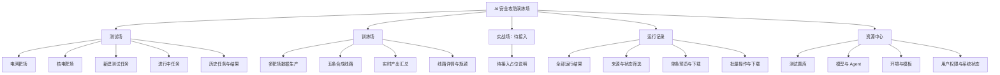
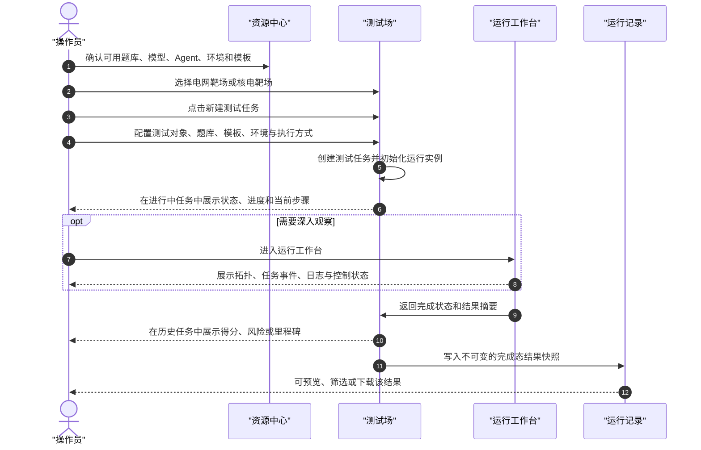
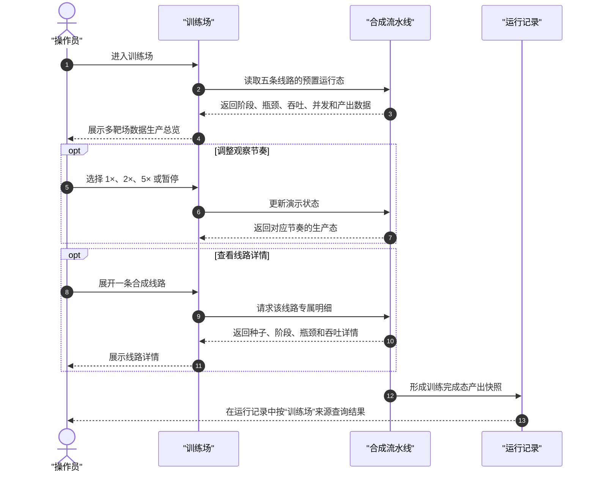
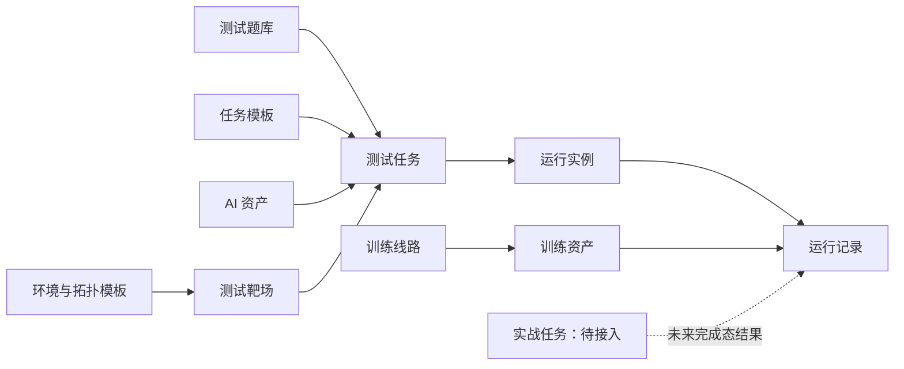

# AI 安全攻防演练场：产品结构与核心流程

## 1. 产品目标

平台围绕安全任务的完整生命周期，为操作员提供统一入口：在测试场创建和运行测试任务，在训练场观察训练资产生产，在运行记录查看跨场结果，在资源中心维护任务可引用的资源。

产品以五个一级 Tab 承载不同职责：测试场负责执行，训练场负责产能观察，实战场预留能力入口，运行记录负责结果归档，资源中心负责资源治理。

## 2. 产品信息架构

## 3. 一级 Tab 功能边界

| 一级 Tab | 负责什么 | 可执行的操作 | 不负责什么 |
|---|---|---|---|
| 测试场 | 电网、核电靶场中的测试任务全生命周期 | 选择靶场，新建任务，查看进行中状态，进入工作台，查看历史任务和完成结果 | 维护题库或模型资产；批量导出跨来源结果；管理训练流水线 |
| 训练场 | 训练资产合成过程与产能的可视化观察 | 切换演示速度，暂停/恢复流水线，展开线路查看阶段、瓶颈与产出详情 | 创建真实训练作业；修改训练资源配置；维护题库或环境 |
| 实战场 | 实战能力的预留入口与状态说明 | 查看待接入状态 | 创建任务、进入工作台、写入运行记录或产生任何运行副作用 |
| 运行记录 | 三个场的完成态结果集中归档、查看和导出 | 按来源、状态、时间等筛选；预览单条结果；单条或批量下载 | 创建或重新执行任务；编辑原始执行结果；管理测试资源 |
| 资源中心 | 被测试和训练任务引用的资源治理 | 维护测试题库、模型、Agent、环境、模板、权限和系统状态 | 启动任务；查看实时执行画面；维护结果归档 |

## 4. 用户故事

用户统一定义为平台操作员。

| 操作员需求 | 如何操作 | 完成后看到的结果 |
|---|---|---|
| 在指定行业场景发起安全测试 | 进入测试场，选择“电网靶场”或“核电靶场”，点击“新建测试任务”，依次选择测试对象、题库、模板、环境和执行方式 | 系统创建测试任务，并将任务置入“进行中任务”列表 |
| 观察测试任务是否正常运行 | 在测试场的进行中任务卡查看进度、耗时、当前步骤和状态；需要深入查看时进入运行工作台 | 看到实时拓扑、风险检测或攻击阶段、日志和进度；任务可显示运行中、暂停、完成或失败状态 |
| 获取已完成测试的结论 | 在测试场历史任务中打开任务，查看结果摘要或完整报告 | 看到得分、风险项、关键里程碑、执行时长和结果结论；完成态快照同步进入运行记录 |
| 了解训练资产的生产状态 | 进入训练场，查看五条并发合成线路与实时产出汇总 | 看到漏洞环境、企业场景、检测数据集、事故现场和 AI 靶场的当前产出、瓶颈和吞吐 |
| 聚焦某条训练线路 | 在训练场点击线路卡片展开详情；必要时调整 1×/2×/5× 演示速度，或暂停流水线 | 看到该线路当前种子、阶段进度、工程瓶颈、吞吐曲线或专属细节；暂停后所有演示态流动停止 |
| 查询跨场完成结果 | 进入运行记录，选择来源场、任务类型、状态和时间范围筛选 | 得到统一结果列表，每条记录带来源标签、结果摘要、完成时间和可执行操作 |
| 预览或导出结果 | 在运行记录中打开单条预览并下载；或勾选多条记录后执行批量下载 | 单条可看到完整摘要或报告；批量操作生成所选记录的统一导出结果 |
| 管理测试所需题库 | 进入资源中心的“测试题库”子页，查看、维护或发布题库 | 新建测试任务时可以引用已发布题库；题库变更不直接修改历史任务的结果快照 |
| 了解实战能力是否可用 | 点击实战场 | 看到明确的“待接入”占位说明，页面不创建任务、不跳转、不产生记录 |

## 5. 核心 Feature

| 一级 Tab | Feature | 说明 |
|---|---|---|
| 测试场 | 靶场选择 | 以电网、核电为一级业务场景，切换后显示相应拓扑、环境状态和可用模板。 |
| 测试场 | 新建测试任务 | 将测试对象、测试题库、任务模板、目标环境与执行方式组合为一个可执行测试任务。 |
| 测试场 | 进行中任务 | 用任务卡汇总运行状态；提供进入工作台的入口，用于查看详细运行过程。 |
| 测试场 | 历史任务与结果 | 展示完成任务的摘要，可进入结果详情并将完成态结果交由运行记录归档。 |
| 训练场 | 多靶场数据生产 | 保留五条差异化生产线路，展示每条线路的阶段、并发、瓶颈和产出类型。 |
| 训练场 | 线路控制与详情 | 支持演示速度、暂停/恢复和线路展开；用于观察生产节奏，不承担真实训练调度。 |
| 实战场 | 待接入占位 | 只传达能力边界和待接入状态，不暴露未实现的执行入口。 |
| 运行记录 | 统一结果视图 | 将测试、训练、实战三个来源的完成态结果按统一字段呈现。 |
| 运行记录 | 结果操作 | 提供筛选、单条预览、单条下载和批量下载；避免直接在归档页修改原始结果。 |
| 资源中心 | 测试题库 | 作为测试题目和基准集的唯一维护入口，供测试场的任务配置引用。 |
| 资源中心 | 平台资源治理 | 管理模型、Agent、环境、模板、权限和系统状态，为其他场提供可引用资源。 |

## 6. 测试任务操作时序图

## 7. 训练任务操作时序图

## 8. 核心对象

| 对象 | 定义 | 所属 Tab | 关键关系 |
|---|---|---|---|
| 测试靶场 | 电网或核电等可选择的测试业务场景 | 测试场 | 为测试任务提供场景、拓扑和环境上下文 |
| 测试任务 | 一次面向模型、Agent 或环境的测试配置 | 测试场 | 引用题库、模板、环境和 AI 资产；创建后生成运行实例 |
| 运行实例 | 测试任务实际执行过程中的实时状态载体 | 测试场 / 运行工作台 | 记录进度、日志、状态和关键事件；完成后生成结果记录 |
| 训练线路 | 一类训练资产的合成生产链路 | 训练场 | 由种子、阶段、瓶颈、并发和产出构成 |
| 训练资产 | 环境、场景、数据集、事故现场或 AI 靶场等训练产出 | 训练场 | 由训练线路生成，并可形成训练来源的结果快照 |
| 实战任务 | 面向实战场的未来执行任务 | 实战场 | 当前仅保留对象定义，不支持创建或执行 |
| 运行记录 | 任一场完成后生成的不可变结果快照 | 运行记录 | 统一关联来源场、任务、执行对象、时间、状态和结果摘要 |
| 测试题库 | 可被测试任务引用的题目、基准或风险项集合 | 资源中心 | 被测试任务配置引用；变更不回写历史结果 |
| 任务模板 | 用于快速创建测试任务的预置配置 | 资源中心 | 组合题库、环境、执行模式与默认参数 |
| 环境与拓扑模板 | 可复用的目标环境、网络拓扑和基础配置 | 资源中心 | 被测试靶场和测试任务引用 |
| AI 资产 | 模型、Agent 与训练版本等可测试或可执行对象 | 资源中心 | 被测试任务选择，作为执行主体或测试对象 |

